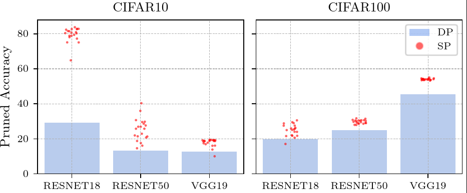
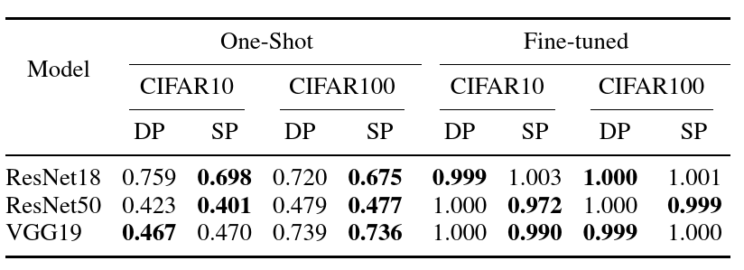

# Stochastic Pruning for Neural Networks

This repository reproduces the experiments from [*"Stochastic Pruning for Neural Networks"*](https://doi.org/10.1109/IJCNN64981.2025.11228768),
published in the Proceedings of the International Joint Conference on Neural Networks
DOI:10.1109/IJCNN64981.2025.11228768



The above image shows different Stochosaticly Pruned models (SP) vs one Deterministicly Pruned model (DP) using Global Magnitude Pruning (GMP) with the parameters for each model and dataset combination (pruning rate and noise level $\sigma$)  in table 1 at the end of this document). Our simple procedure adds Gaussian Noise (with fixed $\sigma$ for all layers) to the dense model and follows it with a pruning procedure (GMP/LAMP/GRASP). 
We note that this simple procedure enhances the pruned accuracy of models through the reduction of what we call 'Feature Variance Explosion (FVE)', which is a discrepancy in the variance of featuremaps between one layer and another. The next table shows the effect of Stochastic Pruning in the overall FVE.


## Repository structure

```
stochastic-pruning/
├── main.py                          # All SP experiment functions + LeMain() entry point
├── train_CIFAR10.py                 # Standalone dense-model training script
├── sparse_ensemble_utils.py         # Shared utilities (model loading, pruning helpers)
├── feature_maps_utils.py            # Feature map / variance utilities
├── fpgm_pruner.py                   # FPGM magnitude pruner
├── plot_utils.py                    # Plotting helpers
│
├── alternate_models/                # ResNet18, ResNet50, VGG19 for CIFAR/ImageNet
├── GRASP/                           # GraSP pruner
├── layer_adaptive_sparsity/         # LAMP / ERK pruners (tools/pruners/)
├── synflow_snip_graps/              # SynFlow / SNIP pruners
├── flowandprune/                    # cal_grad helper used by sparse_ensemble_utils
├── shrinkbench/                     # FLOPs counter (metrics/flops.py)
│
├── trained_models/                  # Dense model checkpoints (input — place here or use --solution)
│   ├── cifar10/
│   └── cifar100/
├── stochastic_pruning_models/       # Pruned model outputs written by main.py
├── stochastic_pruning_data/         # Sigma/PR data files written by main.py
├── datasets/                        # CIFAR dataset root (auto-downloaded by PyTorch)
│
├── slurm_train_CIFAR10_handler.sh   # Launch dense-model training jobs (preliminary step)
├── slurm_train_CIFAR10_run.sh       # SLURM worker for train_CIFAR10.py
├── slurm_SP_one_shot_pruning_handler.sh  # Launch exp 1 (one-shot stochastic pruning)
├── slurm_SP_one_shot_pruning_run.sh      # SLURM worker for exp 1
├── slurm_SP_fine_tuning_handler.sh  # Launch exp 2 (SP + fine-tune)
├── slurm_SP_fine_tuning_run.sh      # SLURM worker for exp 2 
├── slurm_SP_moo_search_handler.sh   # Launch exp 3 (Optuna MOO sigma/PR search)
├── slurm_SP_moo_search_run.sh       # SLURM worker for exp 3
│
├── local_train_CIFAR10_handler.sh        # Non-SLURM equivalent of slurm_train_CIFAR10_handler.sh
├── local_train_CIFAR10_run.sh            # Non-SLURM equivalent of slurm_train_CIFAR10_run.sh
├── local_SP_one_shot_pruning_handler.sh  # Non-SLURM equivalent of slurm_SP_one_shot_pruning_handler.sh
├── local_SP_one_shot_pruning_run.sh      # Non-SLURM equivalent of slurm_SP_one_shot_pruning_run.sh
├── local_SP_fine_tuning_handler.sh       # Non-SLURM equivalent of slurm_SP_fine_tuning_handler.sh
├── local_SP_fine_tuning_run.sh           # Non-SLURM equivalent of slurm_SP_fine_tuning_run.sh
├── local_SP_moo_search_handler.sh        # Non-SLURM equivalent of slurm_SP_moo_search_handler.sh
└── local_SP_moo_search_run.sh            # Non-SLURM equivalent of slurm_SP_moo_search_run.sh
```

---

## Workflow

### Step 0 — Install dependencies

```bash
conda env create -f environment.yml
conda activate <env_name>
```

### Step 1 — Train dense models (or bring your own checkpoints)

```bash
bash slurm_train_CIFAR10_handler.sh
```

Trains ResNet18, ResNet50, VGG19 on CIFAR-10 and CIFAR-100 (200 epochs each).
Checkpoints are saved to `trained_models/{cifar10,cifar100}/`.

To use existing checkpoints instead, pass them via `--solution` on the command line
(see *Running experiments manually* below).

### Step 2 — One-shot stochastic pruning (Table 1, exp 1)

```bash
bash slurm_SP_one_shot_pruning_handler.sh
```

Runs `one_shot_static_sigma_stochastic_pruning()` for all 6 model/dataset combinations
from Table 1 of the paper (5 independent seeds via `--array=1-5`).

### Step 3 — Fine-tune after stochastic pruning (Table 1, exp 2) + deterministic baseline (exp 6)

```bash
bash slurm_SP_fine_tuning_handler.sh
```

Submits both exp=11 (stochastic) and exp=6 (deterministic) jobs per combination.

### Step 4 — Multi-objective Optuna search for σ and pruning rate (exp 4)

> **Note**: the `optuna.create_study` / `study.optimize` block inside
> `run_pr_sigma_search_MOO_for_cfg()` (exp 4) is commented out in `main.py`.
> Uncomment lines ~1686–1707 before running. The equivalent fully-working pattern
> is in exp 5 (`run_pr_sigma_fine_tuned_search_MOO_for_cfg`).

```bash
bash slurm_SP_moo_search_handler.sh
```

Optuna results are stored in `find_pr_sigma_database_MOO_*.dep` (SQLite) so the
search can be resumed across jobs.

---

## Running locally (without a SLURM cluster)

Each `slurm_*.sh` pair has a `local_*.sh` counterpart that runs the exact same Python
commands directly in your current shell, with no `sbatch`/`#SBATCH` dependency. Use these
if you don't have access to a SLURM cluster. They run jobs sequentially (instead of
submitting them to a scheduler) and write the same `*.out`/`*.err` log files to the
current directory. Activate your conda/venv environment first, then run the matching
handler script in place of its `slurm_*` version:

```bash
bash local_train_CIFAR10_handler.sh        # Step 1 — train dense models
bash local_SP_one_shot_pruning_handler.sh  # Step 2 — one-shot stochastic pruning
bash local_SP_fine_tuning_handler.sh       # Step 3 — fine-tune after pruning + deterministic baseline
bash local_SP_moo_search_handler.sh        # Step 4 — Optuna MOO sigma/PR search
```

Each handler loops over the same (model, dataset, sigma, pruning_rate) combinations as
its SLURM counterpart, calling the matching `local_*_run.sh` worker script directly
(`bash local_*_run.sh ...`) instead of `sbatch ... slurm_*_run.sh`. Where the SLURM
version used `--array=1-5` for repeated seeds, the local version runs a `for` loop of 5
sequential repeats instead.

---

## Running experiments manually

```bash
python main.py \
  -exp 1 \
  --architecture resnet18 \
  --dataset cifar10 \
  --pruner global \
  --sigma 0.005 \
  --pruning_rate 0.9 \
  --modeltype alternative \
  --epochs 0 \
  --name my_run \
  --solution trained_models/cifar10/my_resnet18.pth
```

Key CLI arguments (`run_le_Main_with_external_parameters`):

| Flag | Description                                                                                                                                      |
|------|--------------------------------------------------------------------------------------------------------------------------------------------------|
| `-exp` | Experiment number (1=one-shot, 2=fine-tune, 4=MOO search)                                                                                        |
| `--architecture` | `resnet18`, `resnet50`, `vgg19`                                                                                                                  |
| `--dataset` | `cifar10`, `cifar100`                                                                                                                            |
| `--pruner` | `global`, `lamp`, `erk`, `random`, `grasp`, `synflow`                                                                                            |
| `--sigma` | Gaussian noise std added before pruning                                                                                                          |
| `--pruning_rate` | Fraction of weights to prune (e.g. `0.9` = 90% sparse)                                                                                           |
| `--modeltype` | `alternative` (use `alternate_models/`)                                                                                                          |
| `--epochs` | Fine-tuning epochs (0 for one-shot, 200 for Table 1 FT)                                                                                          |
| `--solution` | Path to pretrained dense checkpoint. If omitted, falls back to the hardcoded default path for this dataset/modeltype/architecture in `LeMain()`. |
| `--sampler` | Optuna sampler: `tpe` or `nsga` (exp 3/4/5 only)                                                                                                 |
| `--trials` | Number of Optuna trials (exp 3/4/5 only)                                                                                                         |
| `--functions` | Fitness function index: `1` or `2` (exp 3/4/5 only)                                                                                              |

---

## Output files

| Location | Contents                                                              |
|----------|-----------------------------------------------------------------------|
| `stochastic_pruning_models/` | Saved pruned model checkpoints (`.pth`)                               |
| `stochastic_pruning_data/` | Per-layer sigma/PR data files (`.pth`, `.csv`)                        |
| `trained_models/` | Dense model inputs (written by `train_CIFAR10.py`, read by `main.py`) |
| `find_pr_sigma_*_database_MOO_*.dep` | Optuna SQLite study files (exp 4/5)                                   |
| `*.out` / `*.err` | SLURM stdout/stderr logs                                              |

---

## Table 1 parameters

| Model | Dataset | σ | Pruning rate |
|-------|---------|---|-------------|
| ResNet-18 | CIFAR-10 | 0.005 | 0.90 |
| ResNet-18 | CIFAR-100 | 0.003 | 0.90 |
| ResNet-50 | CIFAR-10 | 0.003 | 0.95 |
| ResNet-50 | CIFAR-100 | 0.001 | 0.85 |
| VGG-19 | CIFAR-10 | 0.003 | 0.95 |
| VGG-19 | CIFAR-100 | 0.001 | 0.80 |
